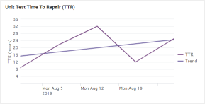
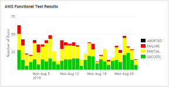
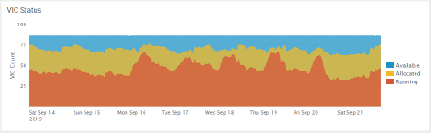
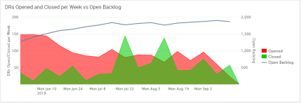

# Pipeline Instrumentation and Visualization Tool (PIVT)

 
 

## Overview

PIVT is used to monitor the software factory. It gives much needed instrumentation and visualization of software development pipelines and tools. The dashboards provide useful information at multiple levels, including middle-level management, software team managers, and software engineers.

The backend is written in Python and Perl and pulls data from tools like Jenkins, ClearQuest, and BitBucket. This data is then fed into Splunk, where a PIVT app lives to serve as the frontend.

## Getting Started

### Hardware Requirements

The hardware specifications of the lab machine PIVT runs on in the Aerospace environment is as follows:
- 16 cores
- 8 GB RAM
- 500 GB storage

These are not hard requirements. We have not tested PIVT on a machine with less resources, so we don't have hard minimum requirements.
An educated guess would be
- 4 cores
- 4 GB RAM
- 500 GB storage

More users require more resources.

### Software Requirements

- Port 8089 on the machine running Splunk must be open if the scripts reside on a different machine
- Python version at least 3.5.2
- Python "requests" module installed
- Python "pyyaml" module installed
- Splunk version at least 7.0.2

### Installation

1. Create a Splunk user and role for the PIVT scripts to use.
	- Role:
		- name: script_user
		- inheritance: can_delete
		- capabilities: indexes_edit, list_inputs
	- User:
		- username: script_user
		- password: changeme

2. If data was included with the new delivery, delete and recreate all pivt_* indexes in Splunk. If not, skip this step.

3. From the PIVT home directory, run

```
./configure.sh <install-target>
./install.sh
```

configure.sh checks for the following:

- A valid Python version (3.5.2+)
- Python requests module installed
- An existing Splunk installation
- A valid Splunk version (7.0.2+)
- outputs a "config.out" file as input for install.sh

install.sh organizes PIVT files into the correct directory structure and installs the PIVT app.\
During installation, you will be asked to authenticate with Splunk.

#### Directory structure

PIVT is organized into several directories:

- `bin/` (scripts)
- `etc/` (configuration files)
- `install/` (installation files)
- `var/` (data and logs)

#### Notable files

##### bin/pivt/export_jenkins.py

Pulls data from Jenkins using the Jenkins REST API. Both instances, "Production" and "Development", are utilized.\
Specific URLs are loaded by the script from the file "etc/sources.txt". Each URL points to a specific CI + "stage" (i.e. "Build," "Deploy," etc.). In the future, these will reside in a configuration file.\
Data is in JSON format and stored in a timestamped directory in var/data/newdata.

##### bin/pivt/export_vic_status.py

Pulls data from the VIC status page using a REST API.
Data is in JSON format and stored in a timestamp directory in var/data/newdata.

##### bin/export_cq.pl

Exports data from ClearQuest using query in CQ database. This data is output to var/data/newdata.

##### bin/pivt/collect.py

Gathers all the data in var/data/newdata and zips it into one archive, placed in var/data/collected.

##### bin/pivt/process.py

Processes the raw data in var/data/collected.
Processed data goes to var/data/data.
Raw data in var/data/collected is moved to var/data/archive.
Requires a PIVT_HOME environment variable set.

##### install/pivt-splunk-app.tar.gz

The PIVT Splunk app contains the dashboards that allow a user to filter and view Jenkins and ClearQuest data graphically in Splunk.
The app will be installed by install.sh.

##### etc/meta.ini

Records the last pull time for each Jenkins job pulled by bin/pivt/export_jenkins.py.

### Notes

bin/ contains some shell scripts that make it easy to execute the Python/Perl scripts.
These should be used instead of calling the Python scripts directly and they should be called on a schedule.

They should be called in a particular sequence:
1. Export scripts
2. Collect script
3. Process script

Minimum desired call rate for export scripts:

- export_jenkins.py: every 6 hours
- export_vic_status.py: every hour
- export_cq.pl: every 24 hours

## License

[Apache 2.0](LICENSE)
